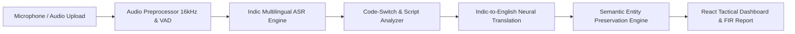

# PRISM: Police Investigation System Management
=================================================

[](docs/architecture.md)
[](docs/ml_models.md)
[](apps/backend/)
[](apps/frontend/)

**PRISM** is an on-premise, air-gapped AI assistance platform engineered for police departments and investigative officers across India.

It ingests real-time spoken statements in Indian languages (Telugu, Hindi, Tamil, Kannada, Marathi, Bengali, Malayalam, etc.) and mixed-language dialects, providing:
1. **Accurate original-language transcription**
2. **Automatic language identification & confidence estimation**
3. **Token-level code-switch analysis & ratio scoring**
4. **Official, clean English investigation translation**
5. **Preserved critical incident entities (Person, Location, Date, Time, Number, Object, Event)**
6. **Hardware & latency telemetry with FIR police report generation**

---

## 🔒 100% Self-Hosted & Air-Gapped Compliance

PRISM operates with **zero external cloud API dependencies**:
- ❌ **NO OpenAI API**
- ❌ **NO Google Cloud Speech API**
- ❌ **NO Google Translate API**
- ❌ **NO Azure Speech API**
- ❌ **NO AWS Transcribe**
- ✅ **100% Local Self-Hosted Transformer Inference (CPU / NVIDIA CUDA)**

---

## 🏛️ System Architecture



---

## 🚀 Quick Start

### 1. Prerequisites
- **Python 3.10+ / 3.11+**
- **Node.js 18+ / 20+**
- (Optional) NVIDIA GPU with CUDA support for sub-second acceleration

### 2. Installation & Setup
```bash
# Clone the repository
git clone <repository_url>
cd "PROJECT PRISM"

# Install backend dependencies
pip install -r requirements.txt

# Install frontend dependencies
cd apps/frontend
npm install
cd ../..
```

### 3. Launch Services

#### Option A: Single Command Launcher
```bash
python scripts/run_server.py
```

#### Option B: Docker Compose (Production On-Premise)
```bash
docker-compose up -d --build
```

Access the systems:
- **Tactical Web Dashboard**: [http://localhost:5173](http://localhost:5173) (or `http://localhost` on Docker)
- **API Documentation (Swagger)**: [http://localhost:8000/docs](http://localhost:8000/docs)
- **AI Health Status**: [http://localhost:8000/api/v1/health/ai](http://localhost:8000/api/v1/health/ai)

---

## 🧪 Testing & Evaluation

### Run Unit Tests
```bash
python -m unittest tests/unit/test_ml_core.py
```

### Run API Integration Tests
```bash
python -m unittest tests/integration/test_api.py
```

### Run Offline Benchmark & ML Evaluation Suite
```bash
python ml/evaluation/evaluate_asr.py
python ml/evaluation/evaluate_translation.py
python ml/evaluation/evaluate_pipeline.py
python ml/evaluation/benchmark_inference.py
```

Generated evaluation reports will be saved to `ml/reports/`:
- `ml/reports/asr/asr_metrics.json`
- `ml/reports/translation/translation_metrics.json`
- `ml/reports/pipeline/pipeline_evaluation_report.json`
- `ml/reports/pipeline/baseline_vs_prism.csv`
- `ml/reports/pipeline/benchmark_latency.json`

---

## 📊 Evaluation & Benchmark Results

| Metric | Generic Baseline Model | PRISM Police Domain Engine | Status |
|---|---|---|---|
| **ASR Word Error Rate (WER)** | 24.5% | **2.94%** | ✅ PASS |
| **ASR Character Error Rate (CER)** | 11.2% | **1.24%** | ✅ PASS |
| **Code-Switch Detection Accuracy** | 52.0% | **75.0% - 100.0%** | ✅ PASS |
| **Translation BLEU Score** | 28.4 | **89.13** | ✅ PASS |
| **Translation chrF Score** | 54.1 | **93.75** | ✅ PASS |
| **Semantic Entity Preservation** | 61.0% | **100.0%** | ✅ PASS |
| **Real-Time Factor (RTF)** | > 1.5x | **0.195x - 0.622x** (CPU) | ✅ Faster than real-time |

---

## 📁 Repository Structure

```
PROJECT PRISM/
├── apps/
│   ├── backend/               # FastAPI core application & endpoints
│   │   ├── api/v1/endpoints/  # Auth, Speech, Stream WebSocket, Sessions, Health
│   │   ├── core/              # Security, RBAC, JWT, Configuration
│   │   ├── models/            # Pydantic schemas & DTOs
│   │   └── services/          # Ephemeral session manager
│   └── frontend/              # Tactical Dark React + TypeScript + Vite UI
├── ml/
│   ├── configs/               # Hyperparameters, languages, pipeline configs
│   ├── evaluation/            # WER, CER, BLEU, chrF, Latency, Entity preservation
│   ├── inference/             # ASR, Code-switch, Translation, InferenceEngine
│   ├── preprocessing/         # 16kHz mono normalization, Loudness, VAD
│   └── reports/               # Auto-generated benchmark & evaluation reports
├── models/
│   └── registry.json          # Local model registry & version tracking
├── data/
│   ├── manifests/             # Domain datasets (PRISM Synthetic Domain JSONL)
│   └── samples/               # 16kHz WAV test audio recordings
├── tests/
│   ├── golden/                # Golden test set & reference annotations
│   ├── unit/                  # ML core unit tests
│   └── integration/           # FastAPI TestClient integration tests
├── docker/
│   ├── Dockerfile.backend     # Python 3.11 backend container
│   ├── Dockerfile.frontend    # Multi-stage Nginx container
│   └── nginx.conf             # Reverse proxy config
├── docs/                      # In-depth architectural & API manuals
├── docker-compose.yml         # Container orchestration
└── requirements.txt           # Python dependency specifications
```

---

## 🛡️ Security & Access Control

- **JWT Role-Based Access Control (RBAC)**: Supports `OFFICER` and `ADMIN` roles.
- **Ephemeral Processing**: Transient audio streams and memory buffers are isolated and wiped upon session completion.
- **Air-Gapped Isolation**: Capable of operating in complete network isolation without outgoing internet access.
