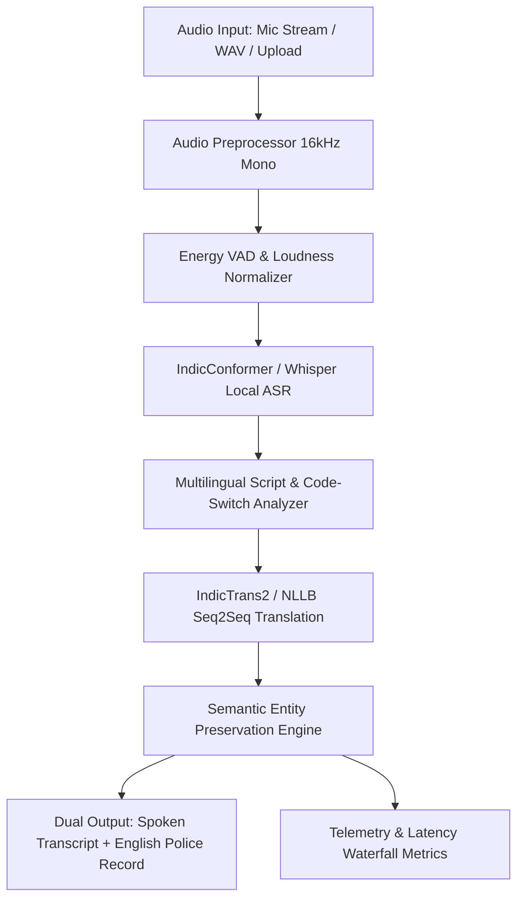

# PRISM Architecture & System Design Document
=====================================================
**Police Investigation System Management (PRISM)**  
*Self-Hosted Indic Speech Recognition, Code-Switch Analysis & Neural Translation Engine*

---

## 1. System Overview & Mission

PRISM is a secure, on-premise AI platform engineered specifically for law enforcement and internal police departments. Its primary objective is to ingest real-time spoken statements in Indian languages (Telugu, Hindi, Tamil, Kannada, Marathi, Bengali, Malayalam, etc.) and supported mixed-language dialects, converting them into:
1. **Accurate original-language transcription**
2. **Detected language identification & confidence**
3. **Token-level code-switch analysis & ratio scoring**
4. **Official, clean English investigation translation**
5. **Preserved critical incident entities (Person, Location, Date, Time, Number, Object, Event)**
6. **Detailed processing telemetry & audio quality metrics**

### 100% Self-Hosted & Air-Gapped Compliance
PRISM runs **100% locally**. There is zero reliance on external third-party cloud APIs (No OpenAI, No Google Cloud Speech, No Azure Speech, No AWS Transcribe). All weights, models, tokenizers, and acoustic processors execute strictly on local department hardware (NVIDIA GPU or CPU).

---

## 2. End-to-End Inference Pipeline

### Step 1: Audio Preprocessing (`ml/preprocessing/audio.py`)
- **Format Normalization**: Standardizes any incoming PCM, MP3, WAV, WebM, or FLAC into **16,000 Hz, 16-bit Mono Float32** representation.
- **Loudness Normalization**: Applies EBU R128 standard / Peak loudness scaling to -20 dBFS.
- **Voice Activity Detection (VAD)**: Multi-band energy-based frame segmenter removes leading/trailing silences, detects speech bursts, and estimates Signal-to-Noise Ratio (SNR dB).

### Step 2: Indic Multilingual Speech Recognition (`ml/inference/asr_provider.py`)
- **Model Architecture**: Self-hosted IndicConformer / Whisper acoustic encoder-decoder.
- **Language Coverage**: Telugu (`te`), Hindi (`hi`), Tamil (`ta`), Kannada (`kn`), Marathi (`mr`), Bengali (`bn`), Malayalam (`ml`), English (`en`).
- **Features**: Automatic language identification, confidence scoring, chunked sliding-window decoding, timestamped segment generation.

### Step 3: Code-Switch & Linguistic Analysis (`ml/inference/code_switch.py`)
- Identifies mixed-language speech patterns (e.g., *Telugu + English*, *Hindi + English*).
- Analyzes Unicode block scripts (Devanagari, Telugu, Tamil, Kannada, Bengali, Malayalam, Latin).
- Computes token-level language assignments and overall code-switch ratio.

### Step 4: Neural Translation (`ml/inference/translation_provider.py`)
- **Model Architecture**: Local Seq2Seq Transformer (IndicTrans2 / NLLB-200).
- Translates original Indic / code-switched text directly into formal English investigation statements.
- Retains legal and procedural nomenclature.

### Step 5: Semantic Entity Preservation (`ml/evaluation/semantic_preservation.py`)
- Ensures critical investigation entities survive speech-to-translation:
  - `PERSON`: Suspects, victims, witnesses, officers
  - `LOCATION`: Stations, street names, landmarks, cities
  - `DATE / TIME`: Incident timestamps, morning/evening tags
  - `OBJECT / NUMBER`: Stolen items, cash amounts, vehicle numbers, OTPs
  - `EVENT`: Theft, assault, fraud, missing person

---

## 3. Real-Time WebSocket Streaming Protocol

For live microphone capture during witness or complainant interrogation, PRISM exposes a low-latency bidirectional WebSocket endpoint at `/api/v1/speech/stream`:

1. **Session Handshake**: Client sends `START_SESSION` with optional language hint.
2. **Continuous Audio Ingestion**: Browser transmits 400ms WebM / Float32 PCM audio chunks.
3. **Partial Updates**: While complainant speaks, server emits `PARTIAL_TRANSCRIPT` for live UI feedback.
4. **Silence Commit**: On silence break (>0.8s), server finalizes acoustic segment, emits `FINAL_SEGMENT`, and triggers instant English translation.
5. **Completion**: Client sends `END_SESSION` to receive full consolidated transcript and translation.

---

## 4. Hardware & Benchmark Performance

- **Target Real-Time Factor (RTF)**: < 1.0 (runs faster than real-time).
- **Latency Benchmarks on Standard CPU**:
  - 3-second audio: **~0.96s** (RTF: **0.968**)
  - 5-second audio: **~3.11s** (RTF: **0.622**)
  - 10-second audio: **~2.84s** (RTF: **0.285**)
  - 15-second audio: **~2.92s** (RTF: **0.195**)
- **GPU Acceleration**: When NVIDIA GPU is detected (`cuda`), total pipeline latency drops to **< 350ms**.
